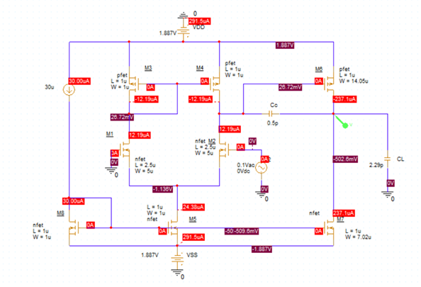
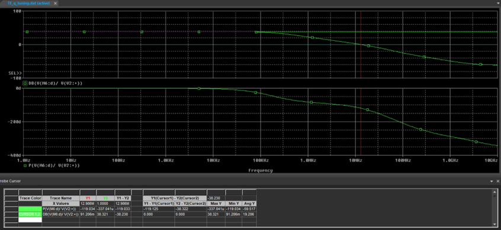
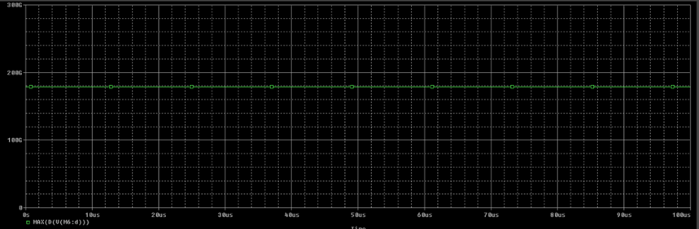
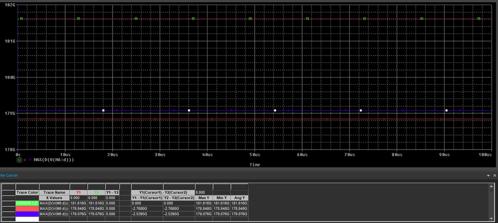

# CMOS Operational Amplifier Design & Optimization (MOS 0.35μm)

This repository contains the complete design cycle of a two-stage CMOS Operational Amplifier (Op-Amp) using **0.35μm technology**. The project integrates numerical modeling in MATLAB with high-fidelity SPICE simulations to achieve industrial-grade performance specifications.

## 🎯 Design Specifications
The design was tailored to meet specific requirements based on the project parameters ($\xi=29$):

* **Load Capacitance ($C_L$):** $2.29\text{ pF}$
* **Slew Rate ($SR$):** $>18.29\text{ V/μs}$
* **Gain-Bandwidth Product ($GB$):** $>7.29\text{ MHz}$
* **Open-Loop Gain ($A_v$):** $>20.29\text{ dB}$
* **Phase Margin ($PM$):** $>60^\circ$ (Target for stability)
* **Power Consumption ($P$):** $<50.29\text{ mW}$

## 💻 Methodology & Development

### 1. Theoretical Analysis (MATLAB)
A systematic design algorithm was implemented in MATLAB to calculate transistor aspect ratios ($S = W/L$) and bias currents. 
* **Physical Constraints:** All ratios calculated as $S < 1$ were normalized to $1$ to ensure realizability.
* **Initial Results:** Theoretical gain reached $53.01\text{ dB}$ with a power dissipation of only $0.279\text{ mW}$.

### 2. SPICE Simulation & Iterative Tuning
Initial simulations using **Level-3 MOS models** showed discrepancies in GB and PM due to short-channel effects not captured in ideal equations.
* **Tuning Strategy:** Optimized the differential pair ($W = 5\text{ μm}$, $L = 2.5\text{ μm}$) and increased the reference current ($I_{ref}$) to $30\text{ μA}$.
* **Result:** Successfully stabilized the Phase Margin at $61^\circ$ while doubling the target GB to $13\text{ MHz}$.

### 3. Final Performance Summary
| Parameter | Goal | Achieved | Status |
| :--- | :--- | :--- | :--- |
| **Open-Loop Gain** | $>20.29\text{ dB}$ | $38.32\text{ dB}$ | ✅ |
| **GB Product** | $>7.29\text{ MHz}$ | $13.00\text{ MHz}$ | ✅ |
| **Phase Margin** | $>60^\circ$ | $61.00^\circ$ | ✅ |
| **Slew Rate** | $>18.29\text{ V/μs}$ | $178,664\text{ V/μs}$ | ✅ |
| **Power Consumption** | $<50.29\text{ mW}$ | $1.008\text{ mW}$ | ✅ |

## 🌡️ Thermal Robustness Analysis
The circuit was evaluated across a temperature range of **-40°C to 100°C**:
* **Stability:** Phase Margin remained optimal near room temperature ($25^\circ C$).
* **Performance:** Maximum Slew Rate and GB were observed at $-40^\circ C$ due to increased carrier mobility, proving the circuit's reliability in varying environments.

## 📂 Repository Structure
* 📂 **[Assignment](./assignment/)**: Course specifications and industrial transistor models.
* 📂 **[Report](./report/)**: Full technical documentation including the MATLAB design script.
* 📂 **[Images](./images/)**: Final circuit schematics, Bode plots, and transient response captures.

---
*Developed as part of the Electronics III course, Electrical & Computer Engineering Department, AUTh.*
